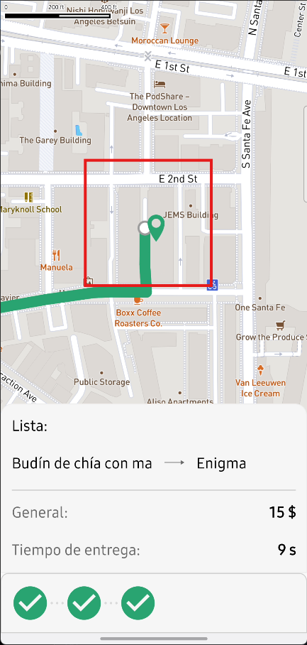

# BUG-001
**Title:** Missing data overlay card for total dish cost on restaurant map pins.

**Component:** Real-Time Tracking MAP UI Component

**Prerequisites**: The user has successfully submitted an order involving dishes prepared by at least one restaurant and is currently on the Real-Time Order Tracking screen.

**Steps to Reproduce**
1. Navigate to the Order Tracking screen.
2. Inspect the active restaurant pins rendered on the map layer.
3. Observe the area immediately above or attached to the restaurant pin to locate the data overlay card.

**Expected Result**: A data overlay card must be displayed on top of the restaurant pin, showing the specific aggregate cost of the dishes assigned to that establishment.

**Actual Result**: There is no data overlay card displayed over the restaurant pin. The map icon renders bare, making the cost breakdown unavailable visually on the map.

**Severity:** 🟠 Major

**Priority:** 🟧 High

**Environment:** Samsung Galaxy S23+ (Android 16, One UI 8.0)

**Traceability:** Linked to [TC-OT-004](../test-artifacts/test-suites/04_order_tracking.md) / [REQ-OT-002](../docs/requirements/04_order_tracking_specs.md#requirements-matrix)

**Visual Evidence** 
