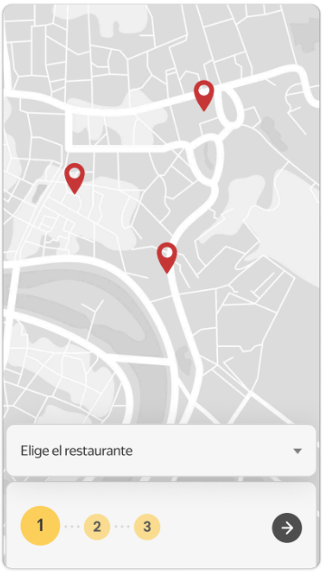

# Functional Requirements Specification: Pick-up Point Selection
**Component ID:** REQ-PP

---

## Requirements Matrix
| Requirement ID | Functional Description | Acceptance Criteria |
| :--- | :--- | :--- |
| **REQ-PP-001** | Interactive Map Rendering | The map must render and display all available order pick-up points upon screen initialization. |
| **REQ-PP-002** | Default Selection State | None of the pick-up points shall be selected by default when the screen loads. |
| **REQ-PP-003** | Visual Selection State | Tapping an unselected pick-up point changes its visual state to black color, marking it as active/selected. |
| **REQ-PP-004** | Selection Cancellation | Tapping a currently selected (black) pick-up point cancels the selection, reverting it to the default state. |
| **REQ-PP-005** | Selection Switching | Tapping an unselected pick-up point while a different one is active must automatically transfer the selection state to the new point and revert the previous one. |

---

## Design References & UI Mockups

| Fig 1.1: Screen Initialization (REQ-PP-001) (REQ-PP-002) |
| :---: |
|  |
| *Map loads with no default selection.* |