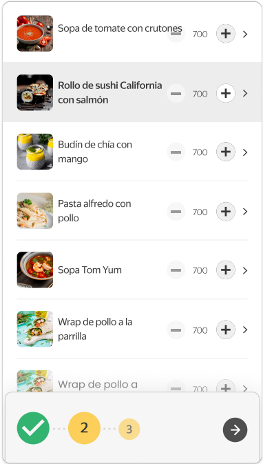
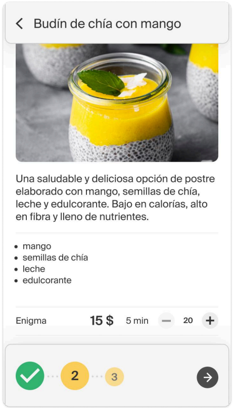

# Functional Requirements Specification: Dish Selection
**Component ID:** REQ-DS

## 1. Dish List Component (Lista de Platillos)
| Requirement ID | Functional Description | Acceptance Criteria |
| :--- | :--- | :--- |
| **REQ-DS-001** | Item Row Elements | Each item container element within the list must display: the dish name, explicit '+' and '-' modifier buttons, a counter, and a navigation arrow indicator. |
| **REQ-DS-002** | Details Navigation | Tapping anywhere on the item row container—excluding the explicit '+' and '-' hit boxes—must route the user to the Dish Details screen. |
| **REQ-DS-003** | Increment Operation | Tapping the '+' button must increment the item counter and append the dish to the active order list from the closest restaurant relative to the pre-selected pick-up point. |
| **REQ-DS-004** | Decrement Operation | Tapping the '-' button must decrement the item counter and remove one instance of that dish from the active order list. |
| **REQ-DS-005** | Footer Progress Bar | The global workflow footer must dynamically reflect states: Step 1 (Pick-up Point) must be marked as 'Completed' (colored indicator), and Step 2 (Dish Selection) must be marked as 'In Progress'. |

## 2. Dish Details Component (Detalles del Platillo)
| Requirement ID | Functional Description | Acceptance Criteria |
| :--- | :--- | :--- |
| **REQ-DS-006** | Content Layout | The screen must structurally display: a high-resolution photo, a general text description, the dish composition/ingredients, and the specific restaurant origin where it is available. |
| **REQ-DS-007** | Back Navigation | An explicit arrow anchor located to the left of the dish name must return the user to the main Dish List view. |
| **REQ-DS-008** | Inline Add Trigger | Tapping the '+' button within the details view must successfully increment and append the dish to the active order list. |
| **REQ-DS-009** | Next Button Constraints | The 'Next' checkout routing button must remain strictly inactive/disabled if the aggregate order list contains zero items. |

## Design References & UI Mockups

| Fig 1: Dish List Component | Dish Details Component |
| :---: | :---: |
|  |  |
| *The screen consists of a list of dishes and a footer.* | *The screen consists of a dish description, the restaurant name, and a footer.* |