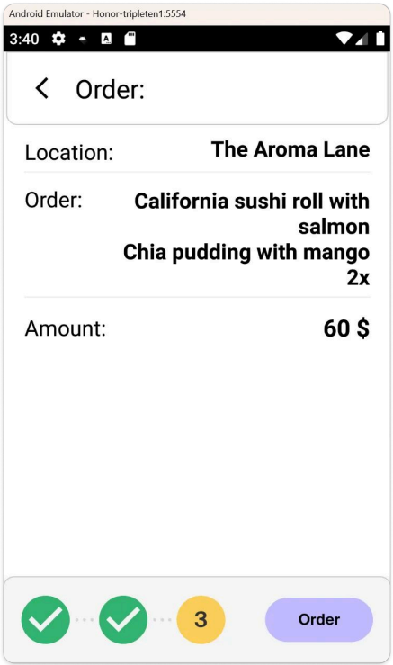

# Functional Requirements Specification: Order Confirmation
**Component ID:** REQ-OC

## Requirements Matrix
| Requirement ID | Functional Description | Acceptance Criteria |
| :--- | :--- | :--- |
| **REQ-OC-001** | UI Layout Components | The screen must structurally display: the pre-selected Pick-up Point name, an explicit "Back" navigation button, the list of selected dishes, the calculated total amount, the estimated delivery ETA, and the operational footer. |
| **REQ-OC-002** | List Scrollability | If the selected dish list length exceeds the available screen vertical bounds, the item container view must support smooth vertical scrolling performance. |
| **REQ-OC-003** | Total Amount Algorithm | The system must dynamically compute the final total amount by balancing the mathematical sum of all dishes, preparation fees, and specific delivery costs. |
| **REQ-OC-004** | Footer Progress Bar | The global workflow footer must dynamically reflect states: Step 1 (Pick-up Point) and Step 2 (Dish Selection) must be marked as completed '✓' (green colored), and Step 3 (Order Confirmation) must be marked as in progress '3'. |
| **REQ-OC-005** | Order Submission Trigger | Tapping the "Order" ("Pedir") button must successfully process the active checkout sequence and route the user directly to the Order Tracking view. |

## Design References & UI Mockups

| Fig 1: Order Confirmation Screen | Fig 2: Order Tracking Screen |
| :---: | :---: |
|  |  |
| *The screen consists of the name of the pickup point, the 'back' button, the dish list, the total amount, the ETA and the footer.* | *The Screen consists of a map, dish list, total amount, address and a timer.* |