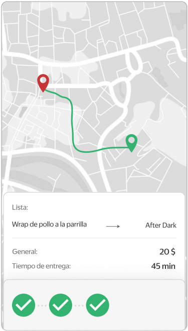
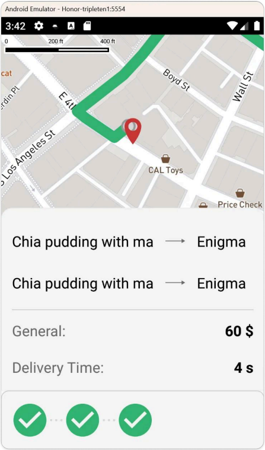

# Functional Requirements Specification: Real-Time Order Tracking
**Component ID:** REQ-OT

## Requirements Matrix
| Requirement ID | Functional Description | Acceptance Criteria |
| :--- | :--- | :--- |
| **REQ-OT-001** | Map Overlay Layout | The map must concurrently render: the target pick-up point location, all restaurant nodes handling the current order, and the active delivery routes connecting restaurants to the pick-up point. |
| **REQ-OT-002** | Restaurant Data Nodes | Each active restaurant node on the map must dynamically display: the aggregated cost of all dishes ordered from that specific location, its preparation time remaining, and the delivery transit ETA. |
| **REQ-OT-003** | Status List Scrollability | If the tracking status elements or restaurant data summaries exceed vertical screen bounds, the interface list container must support standard drag vertical scrolling. |
| **REQ-OT-004** | Global Countdown Timer | A master tracking countdown timer must display the unified remaining time until all components of the order are successfully gathered at the pick-up point. |
| **REQ-OT-005** | Timer Expiration Lifecycle | The moment the countdown timer transitions exactly to zero (0:00) and all dishes are delivered, the application must immediately trigger an automated transition to the "Order Dispatched" screen. |

## Design References & UI Mockups

| Fig 1: Order Tracking Screen |
| :---: |
|  |  |
| *The screen consists of a map, dish list, total amount, address and a timer. In the test version of the app, the timer is always set to 15 seconds.* |