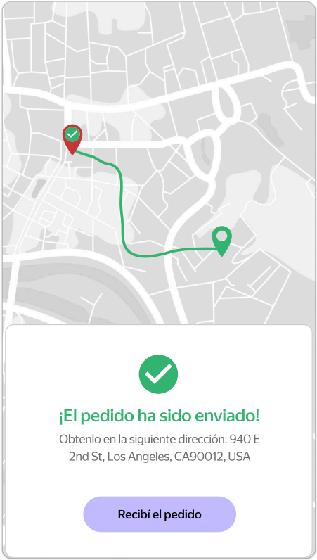

# Functional Requirements Specification: Order Dispatched & Error Notifications
**Component ID:** REQ-OD

## 1. Order Dispatched & Completion Lifecycle
| Requirement ID | Functional Description | Acceptance Criteria |
| :--- | :--- | :--- |
| **REQ-OD-001** | Automated Transition | The application must automatically transition to the "Order Dispatched" ("El pedido ha sido enviado") screen the exact moment the tracking countdown timer expires. |
| **REQ-OD-002** | Destination Mapping | The map component on the success screen must explicitly render a visual anchor/pin marking the exact location of the selected Pick-up Point. |
| **REQ-OD-003** | Completion Flow Workflow | Tapping the primary action button on the success screen must flag the current order as completed, route the user directly to the Feedback Screen, and subsequently redirect them to the baseline Pick-up Point Selection view to initialize a new order sequence. |

## 2. Error Notifications (Client-Side Constraints)
| Requirement ID | Functional Description | Acceptance Criteria |
| :--- | :--- | :--- |
| **REQ-OD-004** | Location Permission Denial | If the user denies or revokes system-level geolocation permissions for the application, an explicit error notification message must be displayed on the UI. |
| **REQ-OD-005** | Empty Cart Guardrail | If the user attempts to submit or process an order structure containing zero selected dishes, the system must block the transaction and prompt an explicit error notification message. |

## Design References & UI Mockups

| Fig 1: The Order Has Been Shipped Screen |
| :---: |
|  |
| *The screen consists of a map, a notification and the "Recibí el pedido" button.* |